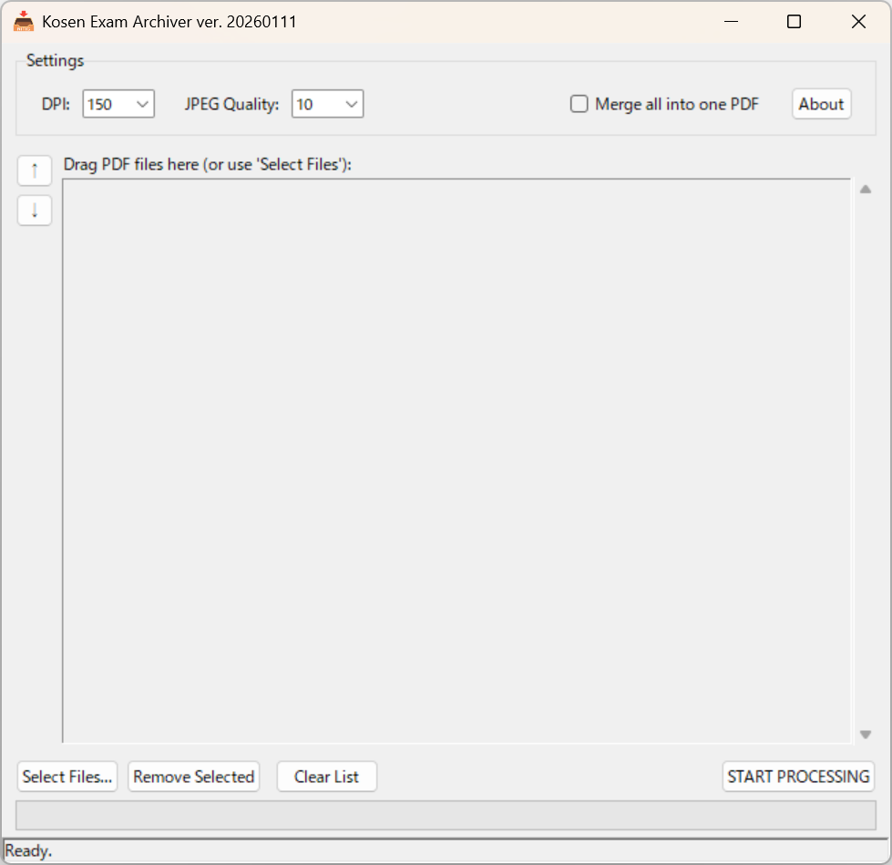

# 📦 Kosen Exam Archiver


**A specialized, drag-and-drop compression tool designed for preserving scanned exam answer sheets.**



---

## 📖 About This Project

**Kosen Exam Archiver** is a desktop utility built to solve a specific problem faced by faculty members at Kosen (National Institute of Technology): **Digital Evidence Preservation.**

When archiving thousands of handwritten exam answer sheets, standard PDF compressors often blur the text or leave "dirty" gray artifacts from the scanner noise. This tool is engineered to produce **High-Contrast, Low-Filesize** archives that serve as perfect digital photocopies.

### ✨ Key Features

* **📄 "Smart Whitening" Algorithm**: Automatically detects the paper background color and snaps it to pure white (RGB 255,255,255), removing scanner noise and reducing file size.
* **🔴 Handwriting Emphasis**: Preserves the clarity of red ink (grading marks) and pencil strokes while aggressively compressing the rest.
* **🧹 Flattening**: Converts complex vector PDF layers into a single, robust raster image. This prevents "missing annotation" bugs in future PDF viewers.
* **⏱️ Auto-Timestamping**: Injects ISO-compliant `CreationDate` and `ModDate` metadata into the PDF for archival integrity.
* **🖱️ Drag-and-Drop Workflow**: Supports dropping individual files, folders, or even dragging files directly onto the `.exe` icon.

---

## 🛠️ Environment & Compilation

If you wish to modify or build this application from the source, you will need the following environment.

### Prerequisites

* **OS**: Windows 10/11
* **Language**: Python 3.10 or newer

### Installation

1. **Clone the repository:**

   ```bash
   git clone [https://github.com/zj13924/KosenExamArchiver.git](https://github.com/zj13924/KosenExamArchiver.git)
   cd KosenExamArchiver
   ```

2. **Install dependencies:**

   ```bash
   pip install pymupdf tkinterdnd2 pyinstaller
   ```
   * `pymupdf`: For PDF rendering and manipulation.
   * `tkinterdnd2`: For native drag-and-drop GUI support.
   * `pyinstaller`: For compiling into a standalone EXE.

### 🏗️ How to Compile

To build the standalone executable (`.exe`) that includes the icon and necessary DLLs, run the following command in your terminal:

   ```bash
   python -m PyInstaller --noconfirm --onefile --windowed --name "KosenExamArchiver" --icon="emoji_u1f4e5.ico" --add-data "emoji_u1f4e5.ico;." --collect-all tkinterdnd2 "ExamArchiver_GUI_v12.py"
   ```
> **Note:** Ensure `emoji_u1f4e5.ico` is present in the source directory before compiling.

---

## ⚖️ License & Credits

This project is licensed under the **GNU Affero General Public License v3.0 (AGPL-3.0)**.
See the [LICENSE](LICENSE) file for details.

### 📚 Third-Party Libraries

This application stands on the shoulders of giants. We gratefully acknowledge the following libraries:

1. **PyMuPDF (fitz)**
   * *Role*: Core PDF processing engine.
   * *License*: GNU AGPL v3.0
   * *Source*: <https://pymupdf.readthedocs.io/>

2. **TkinterDnD2**
   * *Role*: Drag-and-drop functionality wrapper.
   * *License*: MIT License
   * *Source*: <https://github.com/pmgagne/tkinterdnd2>

### 🎨 Assets

* **Application Icon**:
  * Based on `emoji_u1f4e5.png` (📥 Inbox Tray) from the **Google Noto Emoji** project.
  * *Modifications*: Custom text overlay added.
  * *License*: Apache License 2.0
  * *Source*: <https://github.com/googlefonts/noto-emoji>

---

## 🤖 AI Declaration

**Transparency Note:**
The source code for this application was **fully generated by Google Gemini**.
The user (repository owner) prompted the logic and design requirements, but did not manually write the Python code. This project serves as a case study in AI-assisted software development for academic administrative tools.

---

## ⚠️ Disclaimer

THE SOFTWARE IS PROVIDED "AS IS", WITHOUT WARRANTY OF ANY KIND, EXPRESS OR IMPLIED, INCLUDING BUT NOT LIMITED TO THE WARRANTIES OF MERCHANTABILITY, FITNESS FOR A PARTICULAR PURPOSE AND NONINFRINGEMENT. IN NO EVENT SHALL THE AUTHORS OR COPYRIGHT HOLDERS BE LIABLE FOR ANY CLAIM, DAMAGES OR OTHER LIABILITY, WHETHER IN AN ACTION OF CONTRACT, TORT OR OTHERWISE, ARISING FROM, OUT OF OR IN CONNECTION WITH THE SOFTWARE OR THE USE OR OTHER DEALINGS IN THE SOFTWARE.
